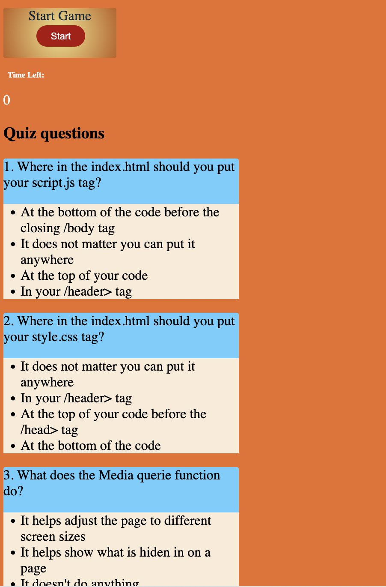

# JavascriptQiz
In this challenge I was meant to create a JavaScript Quiz game where the questions where hiden at the beginning of the game.

As you start the game a timer start and then the first question of five shows up. 

If you get the answer wright then you get a point but if you get the question wrong then time is deducted from the clock.

If the timer runs out or the user reaches the last question then the Text Game over, the users score and a text box to write their initials will show up

Github Repo: https://github.com/Tonyoffor/JavascriptQiz

Deployed Link:  https://tonyoffor.github.io/JavascriptQiz/

